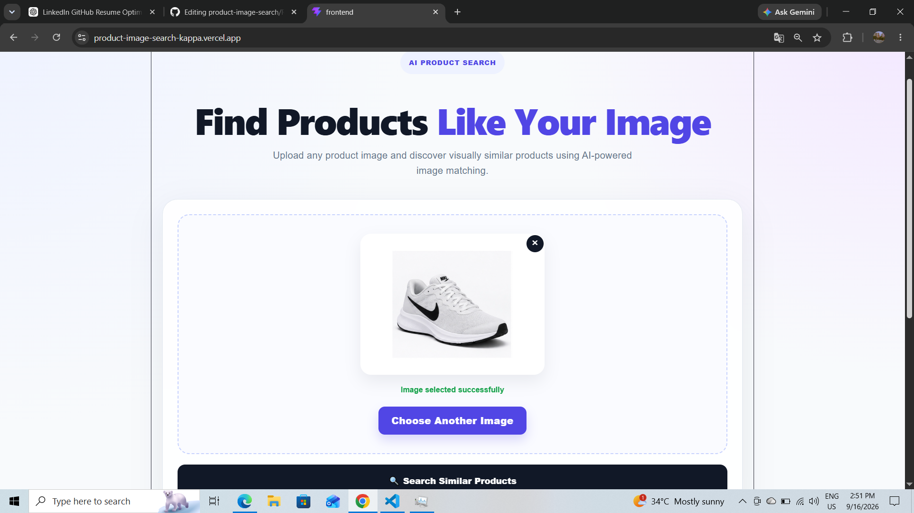
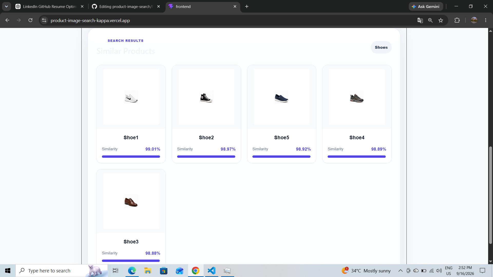

# Product Image Search

An AI-powered image similarity search application that finds visually similar products from an uploaded image using deep-learning-based image features.

## Live Demo

🔗 **Live Application:** https://product-image-search-kappa.vercel.app/

## Screenshots

### Home / Upload Interface



### Image Search Results



## Features

- Upload a product image
- Automatically identify the product category
- Extract visual features using MobileNetV2
- Filter unrelated product categories
- Compare products using cosine similarity
- Rank and display the top visually similar products
- Responsive and modern React interface

## Product Categories

The dataset currently includes:

- Shoes
- Bags
- Watches
- Headphones
- Phones
- Laptops
- Sunglasses
- Bottles
- Hats
- Earphones

## Tech Stack

### Frontend
- React.js
- Vite
- CSS

### Backend
- Python
- Flask
- Flask-CORS

### AI/ML
- TensorFlow
- Keras
- MobileNetV2
- NumPy
- Pillow

## How It Works

1. The user uploads a product image.
2. The Flask backend receives the image.
3. MobileNetV2 extracts visual features from the image.
4. The system identifies the closest product category.
5. Products from unrelated categories are filtered out.
6. Cosine similarity is used to compare visual features.
7. Products are ranked based on similarity.
8. The top matching products are displayed in the React interface.

## Project Structure

```text
product-image-search/
│
├── backend/
│   ├── dataset/
│   ├── uploads/
│   └── app.py
│
├── frontend/
│   └── src/
│
├── screenshots/
│   ├── home.png
│   └── results.png
│
├── .gitignore
└── README.md